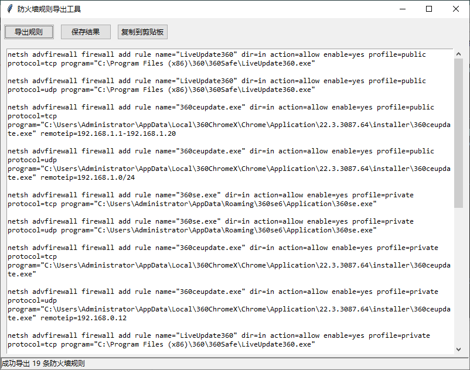
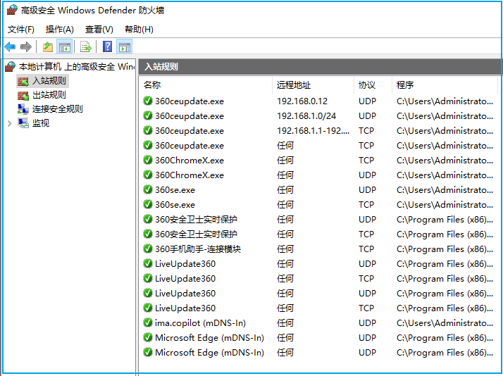

# 导出Windows防火墙规则

将 windows 防火墙规则导出为 netsh 脚本

## 工具截图



## 支持的防火墙规则

- 出站、入站
- 协议：tcp 、udp 、icmp
- 规则中含应用程序路径
- 规则中含IP段
- 指定端口

Windows 防火墙默认的导出格式不可读，并且导入时会覆盖原始规则。




使用`export_rules`工具导出的防火墙规则示例：

```bash
netsh advfirewall firewall add rule \
    name="360ceupdate.exe" \
    dir=in \
    action=allow \
    enable=yes \
    profile=public \
    protocol=tcp \
    program="C:\Users\Administrator\AppData\Local\360ChromeX\Chrome\Application\22.3.3087.64\installer\360ceupdate.exe" \
    remoteip=192.168.1.1-192.168.1.20

netsh advfirewall firewall add rule \
    name="inner" \
    dir=out \
    action=allow \
    enable=yes \
    remoteip=10.0.0.0/8,172.16.0.0/12,192.168.0.0/16

netsh advfirewall firewall add rule \
    name="ping" \
    dir=in \
    action=allow \
    enable=yes \
    protocol=icmpv4
```
